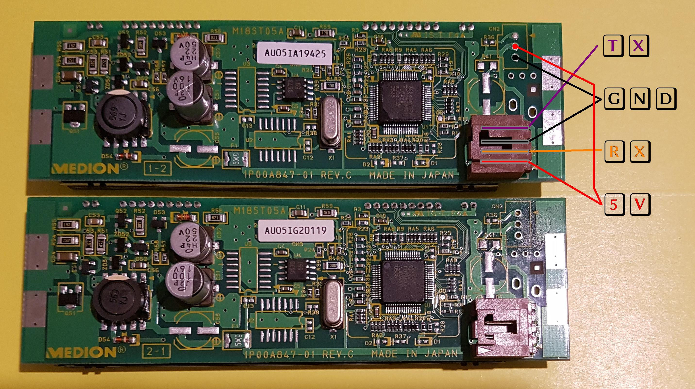

# M18ST05 #

This is a small commandline utility for Medion's VFD Displays
built into some of their computers.

The linux tool is below 15k in size.
Future development will bring a DOS utility, too.

It seems, there are different models, M18ST05A and M18ST05B.
I don't know about differences yet.

# Protocol
There are very few sources about these displays out there.
One of the most complete available is (was) located here:
 (archive.org link).  
I discovered a few more commands while trying other Futaba
display's commands and created a text file with all known
commands (05/2019). You can read it at 'protocol.txt'.  
Newly discovered commands include `dimming` and a really nice
built-in `demo`!. Scroll down to pictures to see it.
`protocol.txt` contains the full documentation, but not so many words like here. 
It is enough to have this file as a reference for using the display.

# Pinout / Hardware connections #
There is quirk in pin names like shown here. I found this pinout
on the internet a few times. I dont want to bring in more confusion and
rename this. So I keep the names and explain here:  
RX is not the futaba chip's RX, it shall be connected to `SERIAL PORT'S RX`.  
TX is not the futaba chip's TX, it shall be connected to `SERIAL PORT'S TX`.  



# Build it #
Go to linux-c folder and simply type make. 
It just needs gcc on your system.

# Usage #
Just run it without arguments, it will print a help.
```
./m18st05a
```
Some simple examples:
```
$ ./m18st05a clear
$ ./m18st05a textl0 "This is Line 0"
$ ./m18st05a textl1 "This is the second Line"
```

# Early development version #
This program is in a very early stage of development and may be buggy.
It does not cover all the functions provided by this display.

# Pictures #
Sorry for the poor image quality on a few pictures. Better may come one day.  
The built in demo spins around all icons and there's snow falling down, very cool:


# Links #
TODO
